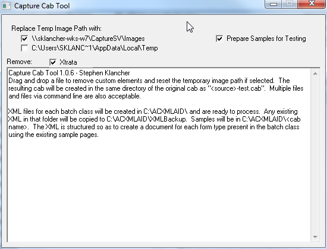

# CaptureCabTool

CaptureCabTool is meant to take a cab file containing Kofax Capture exported Batch Classes and strip out the custom components.  Kofax Capture will not let you import a cab file that references components you don't have installed.  The workaround is fake-register the component so the system thinks they are installed, but that is very messy.

This was the first utility I made while working for Kofax, and also the last time I used VB6 to start a new project.

## Origial Readme

This must either be used on a computer with Capture installed or with KfxCabAR.exe (from the bin folder) on the PATH environment variable or in the application folder.

Drag and drop a file to remove custom elements and reset the temporary image path if selected.  The resulting cab will be created in the same directory of the original cab as "\<source>-test.cab".  Multiple files and files via command line are also acceptable.

XML files for each batch class will be created in C:\ACXMLAID\ and are ready to process.  Any existing XML in that folder will be copied to C:\ACXMLAID\XMLBackup.  Samples will be in C:\ACXMLAID\<cab name>.  The XML is structured so as to create a document for each form type present in the batch class using the existing sample pages.

Database Versions recognized, Release Scripts allowed, and Custom Modules allowed can be added via adding a file named CaptureCapTool.xml in the exe directory.  (The defaults are hardcoded.)  The format is as follows:

```xml
<CaptureCabTool>
    <DatabaseVersion CaptureVersion="7.5" DatabaseVersion="23" />
    <ReleaseScript Name="Ascent Capture Text" />
    <Module Name="scan.exe" />
</CaptureCabTool>
```

Tested with cabs from 6.1-8.0.

### Versions

- 1.0.4 - Now handles custom modules in the following Batch Class settings: Auto-Foldering, Partial Batch Release, and Sort Options
- 1.0.5 - Fix issue with cabs with no sample images.
- 1.0.6 - Fix in 1.0.4 broke cabs from 6.1 because they did not have those settings.  Fixed.

